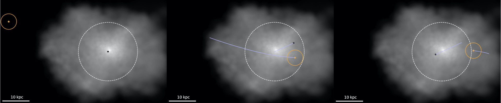

# pyCelebi (CEntraLE Black hole orbital Integration)

    

</body>

[pyCelebi](https://github.com/Blackholan/pyMBHdyn) is a Python package which tracks the orbit of the central SMBH in 370 bright central galaxies by
using orbital integration methods after analysing the merger history of the central galaxies within its galaxy cluster. pyCelebi intensively uses [galpy](https://www.galpy.org/) for galactic dynamics and [IllustrisTNG-300](https://www.tng-project.org/data/downloads/TNG300-1/) to model a realistic galaxy cluster environment. Tracking the dynamics of the central BH of one BCG from z=2 to z=0 in a BCG+environment potential plus dynamical friction takes of the order of 0.05 CPU hrs.

More details on the method and applications can be found in the paper:

[Off-centre supermassive black holes in bright central galaxies](https://arxiv.org/abs/2212.13277) [code paper]

All the compiled Illustris TNG-300 data for the 370 galaxy clusters used in [Chu et al. +22](https://arxiv.org/abs/2212.13277) are available [here](https://www.iap.fr/useriap/boldrini/data.html).

### Usage

This repository contains: 

* Jupyter notebook
* Input data

## Authors

pyCelebi is distributed under the MIT license. See [MIT License](https://en.wikipedia.org/wiki/MIT_License) for more details. 
If you use pyCelebi in a publication, please cite the code paper [Chu et al. +22](https://arxiv.org/abs/2212.13277) and the galpy paper [Bovy +15](https://arxiv.org/abs/1412.3451).

* [Pierre Boldrini](mailto:boldrini@iap.fr) -- Sorbonne University, Institut d'Astrophysique de Paris (IAP), France
* [Aline Chu](mailto:aline.chu96@gmail.com) -- Stockholm University, Oskar Klein Center, Sweden

